NHANES BioData Exploratory Data Analysis - Physical Activity
================
JM
2018-12-03

-   [Data](#data)
-   [What is the percent missing for PhysActive (yes/no physically active)?](#what-is-the-percent-missing-for-physactive-yesno-physically-active)
-   [What are the characteristics of people who have missing responses for PhysActive?](#what-are-the-characteristics-of-people-who-have-missing-responses-for-physactive)
-   [How does missingness and responses in PhysActive relate to responses and missingness in PhysActiveDays and PhysActiveDaysAtLeast3?](#how-does-missingness-and-responses-in-physactive-relate-to-responses-and-missingness-in-physactivedays-and-physactivedaysatleast3)
-   [Is there something strange about Age?](#is-there-something-strange-about-age)
-   [What is the median and interquartile range of PhysActiveDays?](#what-is-the-median-and-interquartile-range-of-physactivedays)
-   [Is number of sleep hours associated with physical activity? Consider using the categorized variable `SleepHrsNightCat`.](#is-number-of-sleep-hours-associated-with-physical-activity-consider-using-the-categorized-variable-sleephrsnightcat.)
-   [What about levels of education?](#what-about-levels-of-education)
-   [What about BMI? Is the association of BMI with physical activity dependent on which measure of activity you use -- PhysActive (yes/no) or PhysActiveDaysAtLeast3?](#what-about-bmi-is-the-association-of-bmi-with-physical-activity-dependent-on-which-measure-of-activity-you-use----physactive-yesno-or-physactivedaysatleast3)
-   [Are there other covariates you expect to be associated with physical activity? How do they relate to each other?](#are-there-other-covariates-you-expect-to-be-associated-with-physical-activity-how-do-they-relate-to-each-other)
-   [Data Dictionary](#data-dictionary)

This is a report showing possible answers posed in the lesson plan on [github](https://github.com/laderast/nhanes_explore/blob/master/lesson_plan.md).

Data
====

Variables:

``` r
names(myDataFrame)
```

    ##  [1] "Gender"                 "Age"                   
    ##  [3] "SurveyYr"               "Race1"                 
    ##  [5] "Race3"                  "MaritalStatus"         
    ##  [7] "BMI"                    "HHIncome"              
    ##  [9] "Education"              "BMI_WHO"               
    ## [11] "BPSysAve"               "TotChol"               
    ## [13] "Depressed"              "LittleInterest"        
    ## [15] "Pulse"                  "Diabetes"              
    ## [17] "DiabetesAge"            "PhysActive"            
    ## [19] "PhysActiveDays"         "PhysActiveDaysAtLeast3"
    ## [21] "SleepHrsNight"          "SleepTrouble"          
    ## [23] "SleepHrsNightCat"       "TVHrsDay"              
    ## [25] "AlcoholDay"             "SmokeNow"              
    ## [27] "Marijuana"

What is the percent missing for PhysActive (yes/no physically active)?
======================================================================

``` r
myDataFrame %>% tabyl(PhysActive) %>% adorn_pct_formatting() %>% kable
```

| PhysActive |   n  | percent | valid\_percent |
|:----------:|:----:|:-------:|:--------------:|
|     No     | 3677 |  36.8%  |      44.2%     |
|     Yes    | 4649 |  46.5%  |      55.8%     |
|     NA     | 1674 |  16.7%  |        -       |

What are the characteristics of people who have missing responses for PhysActive?
=================================================================================

-   tend to be missing in other lifestyle questionnaires (smoking, education, etc)
-   seem to be mostly children

``` r
myDataFrame %>% filter(is.na(PhysActive)) %>% skim()
```

    ## Skim summary statistics
    ##  n obs: 1674 
    ##  n variables: 27 
    ## 
    ## ── Variable type:character ───────────────────────────────────────────────────────
    ##          variable missing complete    n min  max empty n_unique
    ##  SleepHrsNightCat    1674        0 1674 Inf -Inf     0        0
    ## 
    ## ── Variable type:factor ──────────────────────────────────────────────────────────
    ##                variable missing complete    n n_unique
    ##                 BMI_WHO     290     1384 1674        4
    ##               Depressed    1674        0 1674        0
    ##                Diabetes     137     1537 1674        2
    ##               Education    1674        0 1674        0
    ##                  Gender       0     1674 1674        2
    ##                HHIncome     110     1564 1674       12
    ##          LittleInterest    1674        0 1674        0
    ##               Marijuana    1674        0 1674        0
    ##           MaritalStatus    1674        0 1674        0
    ##              PhysActive    1674        0 1674        0
    ##  PhysActiveDaysAtLeast3    1252      422 1674        2
    ##                   Race1       0     1674 1674        5
    ##                   Race3     824      850 1674        6
    ##            SleepTrouble    1674        0 1674        0
    ##                SmokeNow    1674        0 1674        0
    ##                SurveyYr       0     1674 1674        2
    ##                TVHrsDay     961      713 1674        7
    ##                                                  top_counts ordered
    ##                                      12.: 1001, NA: 290, 18   FALSE
    ##        NA: 1674, Non: 0, Sev: 0, Mos: 0                       FALSE
    ##               No: 1534, NA: 137, Yes: 3                       FALSE
    ##        NA: 1674, 8th: 0, 9 -: 0, Hig: 0                       FALSE
    ##               mal: 866, fem: 808, NA: 0                       FALSE
    ##  mor: 323, 750: 196, 250: 175, 350: 147                       FALSE
    ##        NA: 1674, Non: 0, Sev: 0, Mos: 0                       FALSE
    ##                 NA: 1674, No: 0, Yes: 0                       FALSE
    ##        NA: 1674, Div: 0, Liv: 0, Mar: 0                       FALSE
    ##                 NA: 1674, No: 0, Yes: 0                       FALSE
    ##             NA: 1252, Yes: 311, No: 111                       FALSE
    ##  Whi: 910, Mex: 262, Bla: 226, Oth: 156                       FALSE
    ##   NA: 824, Whi: 430, Mex: 132, Bla: 118                       FALSE
    ##                 NA: 1674, No: 0, Yes: 0                       FALSE
    ##                 NA: 1674, No: 0, Yes: 0                       FALSE
    ##               201: 850, 200: 824, NA: 0                       FALSE
    ##   NA: 961, 2_h: 220, 1_h: 174, 0_t: 110                       FALSE
    ## 
    ## ── Variable type:integer ─────────────────────────────────────────────────────────
    ##        variable missing complete    n   mean    sd p0  p25 p50 p75 p100
    ##             Age       0     1674 1674   5.54  3.56  0  2     5   9   16
    ##      AlcoholDay    1674        0 1674 NaN    NA    NA NA    NA  NA   NA
    ##        BPSysAve    1151      523 1674 100.26  9.04 79 94   100 105  136
    ##     DiabetesAge    1671        3 1674  11.67  0.58 11 11.5  12  12   12
    ##  PhysActiveDays    1252      422 1674   3.84  1.88  1  2     4   5    7
    ##           Pulse    1150      524 1674  82.44 11.36 44 74    82  90  134
    ##   SleepHrsNight    1674        0 1674 NaN    NA    NA NA    NA  NA   NA
    ##      hist
    ##  ▇▆▅▅▅▃▁▁
    ##          
    ##  ▁▅▇▇▃▂▁▁
    ##  ▃▁▁▁▁▁▁▇
    ##  ▅▅▇▅▁▆▂▅
    ##  ▁▁▆▇▅▁▁▁
    ##          
    ## 
    ## ── Variable type:numeric ─────────────────────────────────────────────────────────
    ##  variable missing complete    n  mean   sd    p0   p25   p50   p75  p100
    ##       BMI     290     1384 1674 17.93 3.92 12.88 15.49 16.7  18.88 38.73
    ##   TotChol    1037      637 1674  4.09 0.63  2.43  3.67  4.06  4.47  6.34
    ##      hist
    ##  ▇▇▂▁▁▁▁▁
    ##  ▁▂▇▇▅▂▁▁

``` r
myDataFrame %>%
      data.frame() %>%
      gg_miss_fct(fct = PhysActive) + 
      theme(axis.text = element_text(size = 15))
```

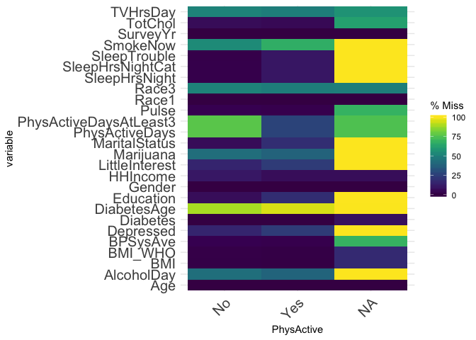

``` r
ggplot(myDataFrame, aes(x=PhysActive, y=Age, fill=PhysActive)) + 
      geom_boxplot() + theme(text=element_text(size=20), axis.text.x = element_text(angle=90))
```

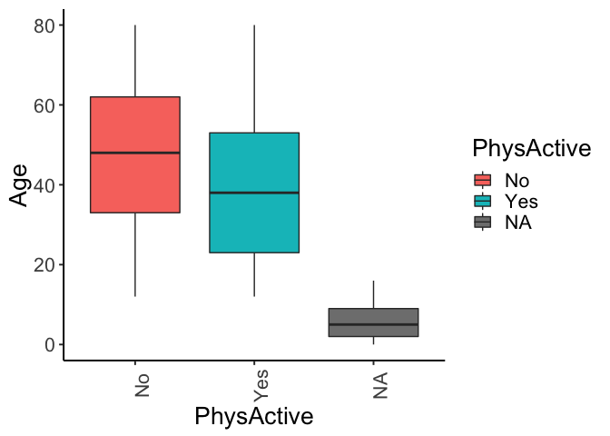

How does missingness and responses in PhysActive relate to responses and missingness in PhysActiveDays and PhysActiveDaysAtLeast3?
==================================================================================================================================

How does the proportion of missingness in PhysActiveDaysAtLeast3 (yes = PhysActiveDays&gt;= 3, no &lt; 3) relate to PhysActive response? Is this what you would expect?

We would expect if `PhysActive`="No" then `PhysActiveDaysAtLeast3` would be either "No" always, or missing. However, there is 77% missingness and 16.7% "Yes" Similarly, when `PhysActive` is NA, there are still ~25% responses to `PhysActiveDaysAtLeast3`.

I would use `PhysActiveDays` and `PhysActiveDaysAtLeast3` very cautiously in analyses!

``` r
data_dictionary %>% filter(str_detect(VariableName,"PhysAct")) %>% kable
```

|      VariableName      |                                                                      Definition                                                                      |
|:----------------------:|:----------------------------------------------------------------------------------------------------------------------------------------------------:|
|       PhysActive       | Participant does moderate or vigorous-intensity sports, fitness or recreational activities (Yes or No). Reported for participants 12 years or older. |
|     PhysActiveDays     |     Number of days in a typical week that participant does moderate or vigorous-intensity activity. Reported for participants 12 years or older.     |
| PhysActiveDaysAtLeast3 |                                                PhysActiveDays&gt;=3 ~ Yes, PhysActiveDays &lt; 3 ~ No                                                |

``` r
percent_table <- myDataFrame %>% data.frame() %>% group_by(PhysActive) %>%
      count(PhysActiveDaysAtLeast3) %>% mutate(ratio=scales::percent(n/sum(n)))
    
myDataFrame %>% 
      ggplot(aes(x=PhysActive, fill=PhysActiveDaysAtLeast3)) + 
      geom_bar(position="fill", color="black") + 
  theme(text=element_text(size=20), 
        axis.text.x = element_text(angle = 90)) +
      geom_text(data = percent_table, mapping = aes(y=n, label=ratio), 
                position=position_fill(vjust=0.5))
```

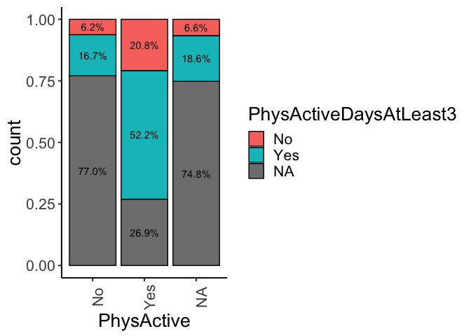

Also, if we look at median `PhysActiveDays` between people who are physically active and who are not, it is roughly the same. Huh??

``` r
ggplot(myDataFrame, aes(x=PhysActive, y=PhysActiveDays, fill=PhysActive)) + 
      geom_boxplot() + theme(text=element_text(size=20), axis.text.x = element_text(angle=90))
```

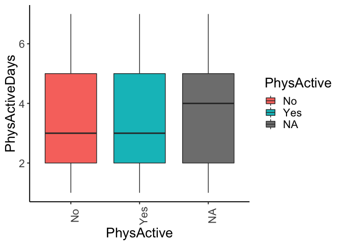

A more granular look at how many physically active days people reported (note how we can see the differences here, but not with using PhysActiveDays as a continuous variable and looking at the median):

``` r
percent_table <- myDataFrame %>% data.frame() %>% group_by(PhysActive) %>%
      count(PhysActiveDays) %>% mutate(ratio=scales::percent(n/sum(n)))

myDataFrame %>% 
      ggplot(aes(x=PhysActive, fill=factor(PhysActiveDays))) + 
      geom_bar(position="fill", color="black") + 
  theme(text=element_text(size=20), 
        axis.text.x = element_text(angle = 90)) +
      geom_text(data = percent_table, mapping = aes(y=n, label=ratio), 
                position=position_fill(vjust=0.5))
```

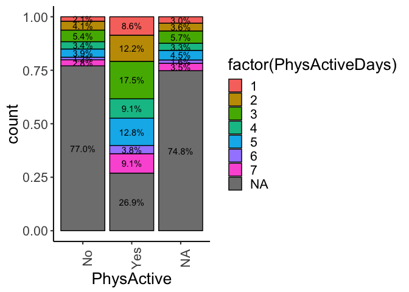

Is there something strange about Age?
=====================================

Age is truncated at 80 for privacy reasons.

``` r
ggplot(myDataFrame, aes(x=Age, y=BMI)) + geom_point()
```

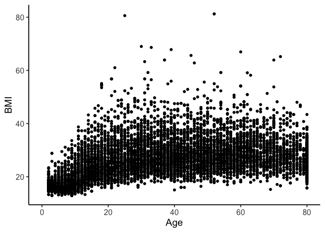

What is the median and interquartile range of PhysActiveDays?
=============================================================

-   This can be found in the skim output: Overview -&gt; Tabular Summary of Data
-   Median 3, IQR \[2,5\]

``` r
myDataFrame %>% select(contains("PhysAct")) %>% skim
```

    ## Skim summary statistics
    ##  n obs: 10000 
    ##  n variables: 3 
    ## 
    ## ── Variable type:factor ──────────────────────────────────────────────────────────
    ##                variable missing complete     n n_unique
    ##              PhysActive    1674     8326 10000        2
    ##  PhysActiveDaysAtLeast3    5337     4663 10000        2
    ##                     top_counts ordered
    ##  Yes: 4649, No: 3677, NA: 1674   FALSE
    ##  NA: 5337, Yes: 3355, No: 1308   FALSE
    ## 
    ## ── Variable type:integer ─────────────────────────────────────────────────────────
    ##        variable missing complete     n mean   sd p0 p25 p50 p75 p100
    ##  PhysActiveDays    5337     4663 10000 3.74 1.84  1   2   3   5    7
    ##      hist
    ##  ▃▆▇▅▁▆▂▅

Is number of sleep hours associated with physical activity? Consider using the categorized variable `SleepHrsNightCat`.
=======================================================================================================================

If we compare median number of hours slept between physical activity categories, we see no difference. However, if we look at sleep as a categorical variable, we see that people with "normal" sleep (6-9 hours sa night) have a slightly higher proportion of physical activity. However, this is a risky analysis since the result really depends on how we categorize our sleep variable.

``` r
ggplot(myDataFrame, aes(x=PhysActive, y=SleepHrsNight, fill=PhysActive)) + 
      geom_boxplot() + theme(text=element_text(size=20), axis.text.x = element_text(angle=90))
```

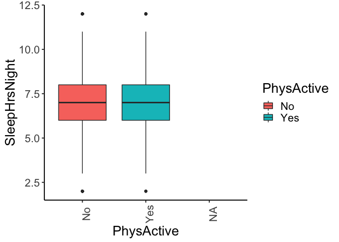

``` r
ggplot(myDataFrame, aes(x=PhysActiveDaysAtLeast3, y=SleepHrsNight, fill=PhysActive)) + 
      geom_boxplot() + theme(text=element_text(size=20), axis.text.x = element_text(angle=90))
```

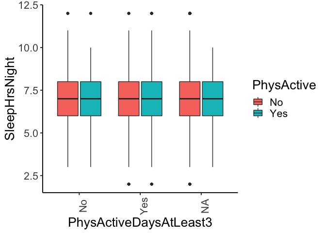

``` r
percent_table <- myDataFrame %>% data.frame() %>% group_by(SleepHrsNightCat) %>%
      count(PhysActive) %>% mutate(ratio=scales::percent(n/sum(n)))
    
myDataFrame %>% 
      ggplot(aes(x=SleepHrsNightCat, fill=PhysActive)) + 
      geom_bar(position="fill", color="black") + 
  theme(text=element_text(size=20), 
        axis.text.x = element_text(angle = 90)) +
      geom_text(data = percent_table, mapping = aes(y=n, label=ratio), 
                position=position_fill(vjust=0.5))
```

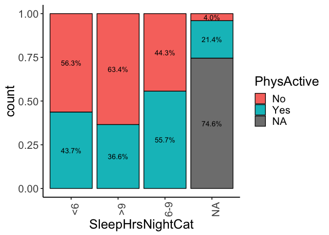

If we use `PhysActiveDaysAtLeast3` we don't see as strong of an association:

``` r
percent_table <- myDataFrame %>% data.frame() %>% group_by(SleepHrsNightCat) %>%
      count(PhysActiveDaysAtLeast3) %>% mutate(ratio=scales::percent(n/sum(n)))

myDataFrame %>%
      ggplot(aes(x=SleepHrsNightCat, fill=PhysActiveDaysAtLeast3)) +
      geom_bar(position="fill", color="black") +
  theme(text=element_text(size=20),
        axis.text.x = element_text(angle = 90)) +
      geom_text(data = percent_table, mapping = aes(y=n, label=ratio),
                position=position_fill(vjust=0.5))
```

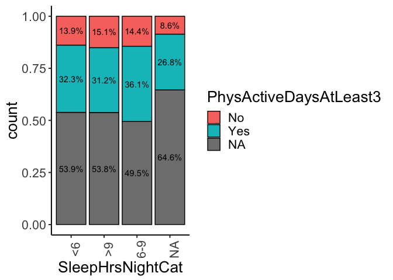

What about levels of education?
===============================

Higher levels of education are associated with increase proportions of physical activity (yes/no) as well as higher proportions of physical activity days &gt;=3.

``` r
percent_table <- myDataFrame %>% data.frame() %>% group_by(Education) %>%
      count(PhysActive) %>% mutate(ratio=scales::percent(n/sum(n)))

myDataFrame %>%
      ggplot(aes(x=Education, fill=PhysActive)) +
      geom_bar(position="fill", color="black") +
  theme(text=element_text(size=20),
        axis.text.x = element_text(angle = 90)) +
      geom_text(data = percent_table, mapping = aes(y=n, label=ratio),
                position=position_fill(vjust=0.5))
```

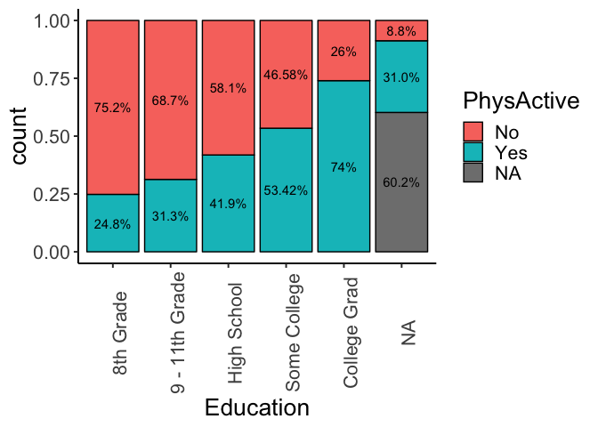

``` r
percent_table <- myDataFrame %>% data.frame() %>% group_by(Education) %>%
      count(PhysActiveDaysAtLeast3) %>% mutate(ratio=scales::percent(n/sum(n)))

myDataFrame %>%
      ggplot(aes(x=Education, fill=PhysActiveDaysAtLeast3)) +
      geom_bar(position="fill", color="black") +
  theme(text=element_text(size=20),
        axis.text.x = element_text(angle = 90)) +
      geom_text(data = percent_table, mapping = aes(y=n, label=ratio),
                position=position_fill(vjust=0.5))
```

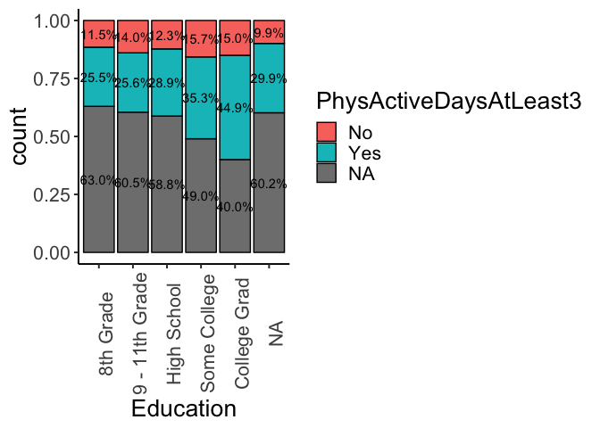

What about BMI? Is the association of BMI with physical activity dependent on which measure of activity you use -- PhysActive (yes/no) or PhysActiveDaysAtLeast3?
=================================================================================================================================================================

There seems to be a small difference in BMI comparing people in physical activity yes/no groups, but when comparing physically active &gt;=3 days yes or no, the difference is nonexistent. Either way, the differences are actually quite small so it is unlikely to be statistically significant.

``` r
ggplot(myDataFrame, aes(x=PhysActive, y=BMI, fill=PhysActive)) + 
      geom_boxplot() + theme(text=element_text(size=20), axis.text.x = element_text(angle=90))
```

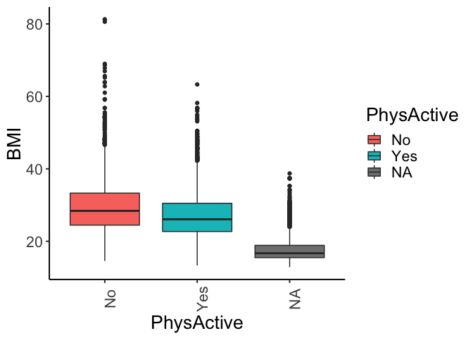

``` r
ggplot(myDataFrame, aes(x=PhysActiveDaysAtLeast3, y=BMI, fill=PhysActiveDaysAtLeast3)) + 
      geom_boxplot() + theme(text=element_text(size=20), axis.text.x = element_text(angle=90))
```

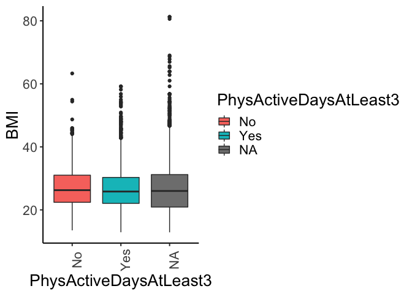

``` r
ggplot(myDataFrame, aes(x=factor(PhysActiveDays), y=BMI, fill=factor(PhysActiveDays))) + 
      geom_boxplot() + theme(text=element_text(size=20), axis.text.x = element_text(angle=90))
```

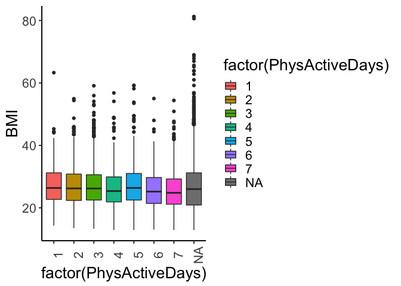

Are there other covariates you expect to be associated with physical activity? How do they relate to each other?
================================================================================================================

We've explored hours of sleep, BMI, and education. There are other lifestyle variables such as hours of TV watched, depression, smoking, Marijuana use, that might be related to physical activity. These are likely associated with each other through a myriad of causal effect pathways.

First, we can note how education and number of hours of sleep per night are also associated, so education may be a confounder in the association of hours per sleep and physical activity.

``` r
percent_table <- myDataFrame %>% data.frame() %>% group_by(Education) %>%
      count(SleepHrsNightCat) %>% mutate(ratio=scales::percent(n/sum(n)))
    
myDataFrame %>% 
      ggplot(aes(x=Education, fill=SleepHrsNightCat)) + 
      geom_bar(position="fill", color="black") + 
  theme(text=element_text(size=20), 
        axis.text.x = element_text(angle = 90)) +
      geom_text(data = percent_table, mapping = aes(y=n, label=ratio), 
                position=position_fill(vjust=0.5))
```

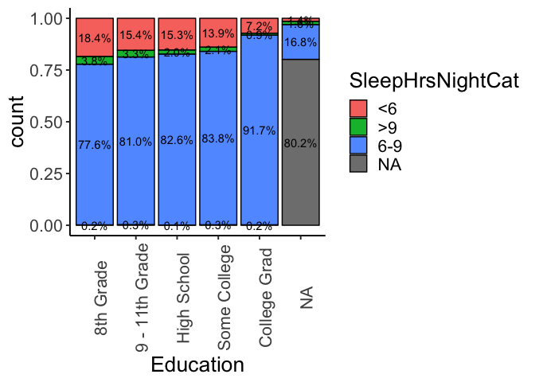

Physical activity is also associated with several other health outcomes including depression and diabetes:

``` r
percent_table <- myDataFrame %>% data.frame() %>% group_by(PhysActive) %>%
      count(Depressed) %>% mutate(ratio=scales::percent(n/sum(n)))
    
myDataFrame %>% 
      ggplot(aes(fill=Depressed, x=PhysActive)) + 
      geom_bar(position="fill", color="black") + 
  theme(text=element_text(size=20), 
        axis.text.x = element_text(angle = 90)) +
      geom_text(data = percent_table, mapping = aes(y=n, label=ratio), 
                position=position_fill(vjust=0.5))
```

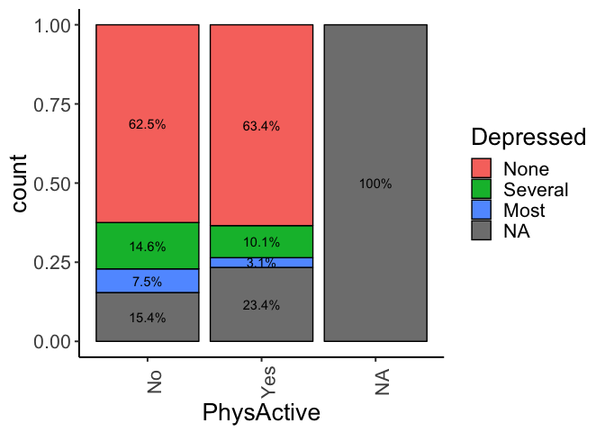

``` r
percent_table <- myDataFrame %>% data.frame() %>% group_by(PhysActive) %>%
      count(Diabetes) %>% mutate(ratio=scales::percent(n/sum(n)))
    
myDataFrame %>% 
      ggplot(aes(x=PhysActive, fill=Diabetes)) + 
      geom_bar(position="fill", color="black") + 
  theme(text=element_text(size=20), 
        axis.text.x = element_text(angle = 90)) +
      geom_text(data = percent_table, mapping = aes(y=n, label=ratio), 
                position=position_fill(vjust=0.5))
```

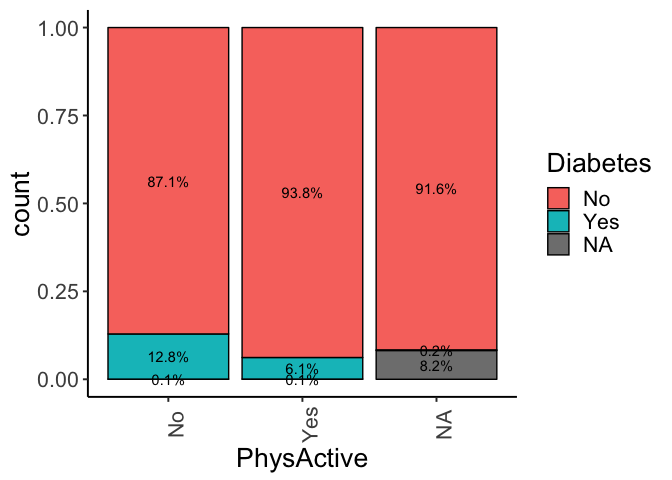

Risk factors such as smoking and TV hours per day are also related. People who smoke are less likely to be physically active.

``` r
percent_table <- myDataFrame %>% data.frame() %>% group_by(SmokeNow) %>%
      count(PhysActive) %>% mutate(ratio=scales::percent(n/sum(n)))
    
myDataFrame %>% 
      ggplot(aes(x=SmokeNow, fill=PhysActive)) + 
      geom_bar(position="fill", color="black") + 
  theme(text=element_text(size=20), 
        axis.text.x = element_text(angle = 90)) +
      geom_text(data = percent_table, mapping = aes(y=n, label=ratio), 
                position=position_fill(vjust=0.5))
```


The relationship between number of TV hours and physical activity is somewhat strange, since those who said 0 hours of TV have a large proportion of not physically active, but 0-1 hours has a much lower proportion of non-physically active and that proportion increases with the number of hours of TV watched. Perhaps people who say no TV are somehow different than people who admit to watching a small amount of TV.

``` r
percent_table <- myDataFrame %>% data.frame() %>% group_by(TVHrsDay) %>%
      count(PhysActive) %>% mutate(ratio=scales::percent(n/sum(n)))
    
myDataFrame %>% 
      ggplot(aes(x=TVHrsDay, fill=PhysActive)) + 
      geom_bar(position="fill", color="black") + 
  theme(text=element_text(size=20), 
        axis.text.x = element_text(angle = 90)) +
      geom_text(data = percent_table, mapping = aes(y=n, label=ratio), 
                position=position_fill(vjust=0.5))
```

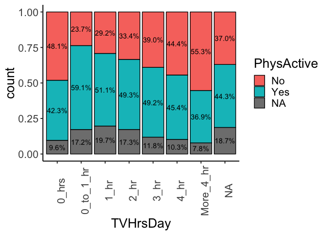

Data Dictionary
===============

``` r
data_dictionary %>% filter(VariableName %in% covariates) %>% kable
```

|      VariableName      |                                                                                                                                           Definition                                                                                                                                           |
|:----------------------:|:----------------------------------------------------------------------------------------------------------------------------------------------------------------------------------------------------------------------------------------------------------------------------------------------:|
|           Age          |                                                                                              Age in years at screening of study participant. Note: Subjects 80 years or older were recorded as 80.                                                                                             |
|       AlcoholDay       |                                                                             Average number of drinks consumed on days that participant drank alcoholic beverages. Reported for participants aged 18 years or older.                                                                            |
|           BMI          |                                                                                                   Body mass index (weight/height2 in kg/m2). Reported for participants aged 2 years or older.                                                                                                  |
|        BMI\_WHO        |                                                                              Body mass index category. Reported for participants aged 2 years or older. One of 12.0\_18.4, 18.5\_24.9, 25.0\_29.9, or 30.0\_plus.                                                                              |
|        BPSysAve        |                                                                                                     Combined systolic blood pressure reading, following the procedure outlined for BPXSAR.                                                                                                     |
|        Depressed       |                                           Self-reported number of days where participant felt down, depressed or hopeless. Reported for participants aged 18 years or older. One of None, Several, Majority (more than half the days), or AlmostAll.                                           |
|        Diabetes        |                                                                         Study participant told by a doctor or health professional that they have diabetes. Reported for participants aged 1 year or older as Yes or No.                                                                        |
|       DiabetesAge      |                                                                                           Age of study participant when first told they had diabetes. Reported for participants aged 1 year or older.                                                                                          |
|        Education       |                                                                 Educational level of study participant Reported for participants aged 20 years or older. One of 8thGrade, 9-11thGrade, HighSchool, SomeCollege, or CollegeGrad.                                                                |
|         Gender         |                                                                                                                    Gender (sex) of study participant,coded as male or female                                                                                                                   |
|        HHIncome        |                      Total annual gross income for the household in US dollars. One of 0 - 4999, 5000 - 9,999, 10000 - 14999, 15000 - 19999, 20000 - 24,999, 25000 - 34999, 35000 - 44999, 45000 - 54999, 55000 - 64999, 65000 - 74999, 75000 - 99999, or 100000 or More.                      |
|     LittleInterest     |                                          Self-reported number of days where participant had little interest in doing things. Reported for participants aged 18 years or older. One of None, Several, Majority (more than half the days), or AlmostAll.                                         |
|        Marijuana       |                                                                                                  Participant has tried marijuana. Reported for participants aged 18 to 59 years as Yes or No.                                                                                                  |
|      MaritalStatus     |                                                    Marital status of study participant. Reported for participants aged 20 years or older. One of Married, Widowed, Divorced, Separated, NeverMarried, or LivePartner (living with partner).                                                    |
|       PhysActive       |                                                                      Participant does moderate or vigorous-intensity sports, fitness or recreational activities (Yes or No). Reported for participants 12 years or older.                                                                      |
|     PhysActiveDays     |                                                                          Number of days in a typical week that participant does moderate or vigorous-intensity activity. Reported for participants 12 years or older.                                                                          |
| PhysActiveDaysAtLeast3 |                                                                                                                     PhysActiveDays&gt;=3 ~ Yes, PhysActiveDays &lt; 3 ~ No                                                                                                                     |
|          Pulse         |                                                                                                                                      60 second pulse rate.                                                                                                                                     |
|          Race1         |                                                                                                         Reported race of study participant: Mexican, Hispanic, White, Black, or Other.                                                                                                         |
|          Race3         |                                                                     Reported race of study participant, including non-Hispanic Asian category: Mexican, Hispanic, White, Black, Asian, or Other. Not availale for 2009-10.                                                                     |
|      SleepHrsNight     |                                                                        Self-reported number of hours study participant usually gets at night on weekdays or workdays. Reported for participants aged 16 years and older.                                                                       |
|    SleepHrsNightCat    |                                                                                                                  SleepHrsNight categorized into &lt;6hrs, \[6-9\]hrs, &gt;9hrs                                                                                                                 |
|      SleepTrouble      |                                                                Participant has told a doctor or other health professional that they had trouble sleeping. Reported for participants aged 16 years and older. Coded as Yes or No.                                                               |
|        SmokeNow        | Study participant currently smokes cigarettes regularly. Reported for participants aged 20 years or older as Yes or No, provieded they answered Yes to having somked 100 or more cigarettes in their life time. All subjects who have not smoked 100 or more cigarettes are listed as NA here. |
|        SurveyYr        |                                                                                                                          Which survey the participant participated in.                                                                                                                         |
|         TotChol        |                                                                                                        Total HDL cholesterol in mmol/L. Reported for participants aged 6 years or older.                                                                                                       |
|        TVHrsDay        |                                        Number of hours per day on average participant watched TV over the past 30 days. Reported for participants 2 years or older. One of 0\_to\_1hr, 1\_hr, 2\_hr, 3\_hr, 4\_hr, More\_4\_hr. Not available 2009-2010.                                       |
